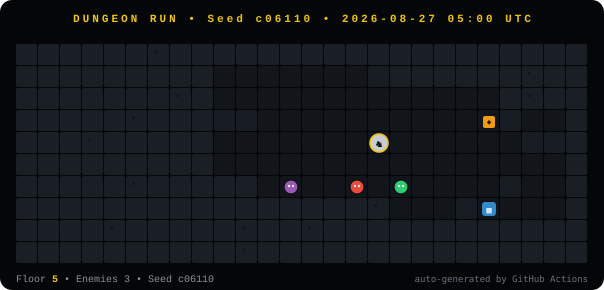

  

  
  
  
   
  
  
  
  

---

### 🧠 Siapa gue?

> **Prompt Architect** — gue bukan tukang ketik kode baris per baris. Gue **arsitek** yang nyuruh AI ngebangun.
> Lu punya ide? Gue punya prompt. AI yang eksekusi. Hasilnya? Produk jalan, klien senang, gue tetap santai. 😎

*Founder of **JokiVerse** — Medan-based, world-class output. Specialist in turning wild ideas into shipped products with AI as the engine.*

- 📍 **Medan, Indonesia** — available remote / freelance
- 🚀 **What I do:** `Idea → Prompt → AI builds → Ship → Scale`
- 🛠️ **Superpower:** Orchestrating ChatGPT / Muse / Cursor / Lovable / any AI to ship 10x faster
- 💬 **Motto:** *"Why code manually when you can command an army of AIs?"*

---

### 🎮 DUNGEON RUN — Live Dungeon (update otomatis tiap 6 jam)

> Mini-game yang hidup di profil ini. Bot yang sama kayak di [**Dungeon-Night**](https://github.com/Neuron700/Dungeon-Night) jalan-jalan & gelud otomatis. Di-generate via **GitHub Actions** — bukan GIF, tapi **SVG yang berubah beneran tiap 6 jam**.

  
   
  ⚙️ <code>scripts/generate_dungeon.py</code> + <code>.github/workflows/dungeon.yml</code> • Seed ganti tiap 6 jam • Refresh halaman buat lihat dungeon baru

  

---

### 🔥 Featured — Karya pilihan

  
  

  
  

  
  

---

### 🧰 Tech Stack — yang gue orchestrate

  
   
  
  

---

### 📊 GitHub Stats

  
  

  

---

### 📫 Connect

  
  
  

  

<!-- Dungeon bot will auto-update assets/dungeon.svg every 6h via GitHub Actions -->
